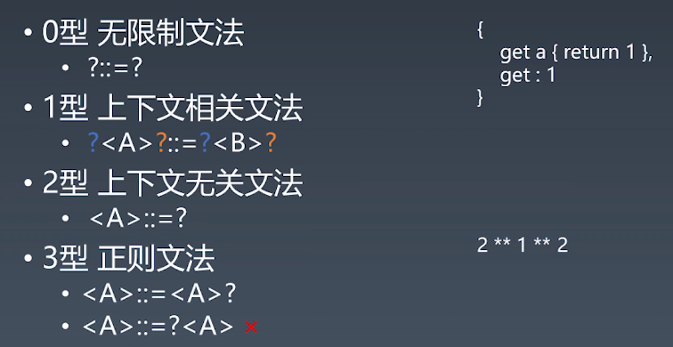
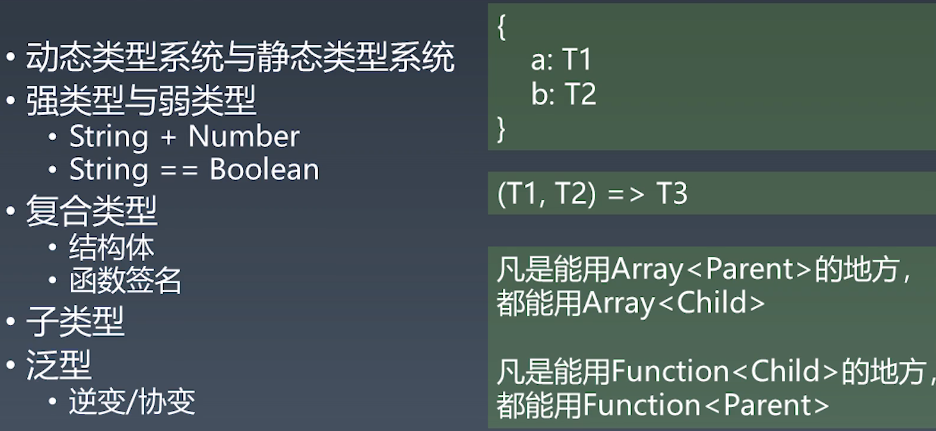
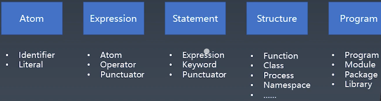

学习笔记
编程语言通识课
# 1（泛用）语言分类
# 1.1非形式语言
# 1.2形式语言（乔姆斯基谱系）
* 0型 无限制文法
* 1型 上下文相关文法
* 2型 上下文无关文法
* 3型 正则文法

前者包含后者，反之不成立，如满足1型，一定满足0型

# 2 产生式（BNF：巴科斯-诺尔范式）
## 2.1概念
* 语法结构名：用尖括号括起来的名称来表示
* 语法结构分成基础结构和(需要用其他语法结构定义的)复合结构
    * 基础结构称 终结符
    * 复合结构称 非终结符
* 符号说明：
    * 引号和中间的字符表示终结符
    * 可以有括号
    * *表示重复多次
    * |表示或
    * +表示至少一次

## 2.1例子
* 四则运算
    * 1+2*3
* 终结符：
    * Number
    * \+ - * /
* 非终结符：
    * MultiplicativeExpression
    * AddtiveExpression
```
<MultiplicativeExpression>::=<Number>|<MultiplicativeExpression>"*"<Number>|<MultiplicativeExpression>"/"<Number>

<AddtiveExpression>::=<MultiplicativeExpression>|<AddtiveExpression>"+"<MultiplicativeExpression>|<AddtiveExpression>"-"<MultiplicativeExpression>
```

# 3 产生式与乔姆斯基谱系


# 4现代编程语言发分类
**大部分编程语言的主体都是上下文无关文法**，或多或少有一些是非形式化语言或者上下文相关文法
# 4.1按用途分
* 数据描述语言，如:JSON, HTML, XML SQL, CSS
* 编程语言,如：C, C++, Java, C#, Python, Ruby,Perl,Lisp, T-SQL, Clojure, Haskell,JavaScript
# 4.2按表达方式分
* 声明式语言，只告诉你结果是怎么样的，如：JSON, HTML,XML, SQL CSS,Lisp, Clojure, Haskell
* 命令型语言，告诉达成结果的每个步骤,如：C, C++, Java, C#, Python, Ruby,Perl,JavaScript

# 5编程语言的性质
## 5.1图灵完备性
* 命令式——图灵机
    * goto
    * if和while
* 声明式——lambda演算（阿隆佐.丘奇）
    * 递归
## 5.2动态有静态
* 动态
    * 在用户的设备/在线服务器上
    * 产品实际运行时
    * Runtime
* 静态
    * 在程序员的设备上
    * 产品开发时
    * Compiletime
## 5.3类型系统

# 6一般命令式编程语言的设计方式
一般会分成5个层级


